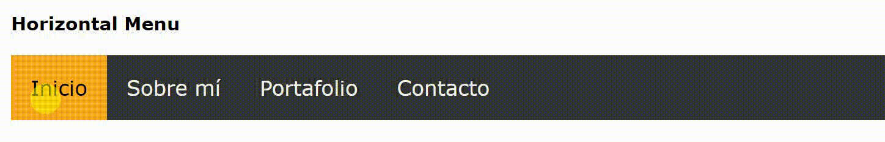

#Menú Horizontal  

### OBJETIVO:  

1. Realizar la replica de una Barra de navegación horizontal.  

### Herramientas:  

1. HTML para estructurar la página.
2. CSS para darle estilo a nuestra barra de navegación.  

